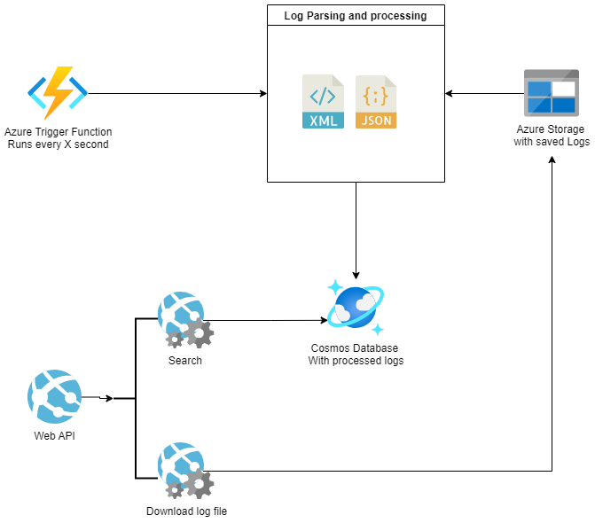

# Message Archive

[](https://codecov.io/gh/Energinet-DataHub/geh-message-archive).

## Intro

Request and response logs are in message-archive processed and saved.
The type of logs are determined and parsed with a xml or json parser.

The processed logs should be searchable and log body can be downloaded form storage.

Logs are saved by a middleware used in domains.
<https://github.com/Energinet-DataHub/geh-core/tree/main/source/Logging>

## Architecture



### Azure function trigger

Runs every X second and parses new logs saved by middleware.

Parsed with a xml or json parser.

Processed log data are saved to Cosmos Database.

### Web API

Download endpoint downloads saved log body content.

<b>GET</b> <span style="color:orange">/api/log/download/ { logname })</span>

```ts
/**
 * @api {get} /api/log/download/{ logname }
 * @apiDescription Downloads saved log body content

 * @apiParam logName string
 */
```

Search endpoint searches in processed logs.

<b>GET</b> <span style="color:orange">/api/log/search</span>

```ts
/**
 * @api {get} /api/log/search
 * @apiDescription Search processed and saved logs

 * @apiParam MessageId string
 * @apiParam MessageType string
 * @apiParam ProcessTypes array
 * @apiParam DateTimeFrom string
 * @apiParam DateTimeTo string
 * @apiParam SenderId string
 * @apiParam ReceiverId string
 * @apiParam SenderRoleType string
 * @apiParam ReceiverRoleType string
 * @apiParam BusinessSectorType string
 * @apiParam ReasonCode string
 * @apiParam InvocationId string
 * @apiParam FunctionName string
 * @apiParam TraceId string
 * @apiParam IncludeRelated boolean
 * @apiParam IncludeResultsWithoutContent boolean
 * @apiParam RsmNames array
 * @apiParam DateTimeFromParsed string
 * @apiParam DateTimeToParsed string
 * @apiParam ContinuationToken string
 * @apiParam MaxItemCount integer
 */
```

## Structure

Code contains two main parts.

One regarding processing and reading log files and one encapsulation a client for connection to the webapi with a factory pattern.

### Processing and reading

The overall structure and idea described here.

- Processing: Processing handler, log parsers, mappers and models.
- Reader: Search query against persistence. Models describing the search criteria and result. Validation and mappers.
- Persistence: Write and read services for log storage.
- Persistence models: Contains shared models between reading and processing.

### Client

- Nuget package with container extensions for setting up client factory for message archive http web api.
- Setup and calls the webapi with an input dto.
